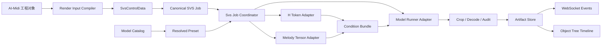

# V5-P 接入架构

合成单元对象、A 区绑定、Take 与导出合同见
[`v5p-synthesis-unit-integration.md`](./v5p-synthesis-unit-integration.md)。上下文交接见
[`v5p-integration-handoff.md`](./v5p-integration-handoff.md)。
早期完整用户流程、ControlData 生命周期、候选比较和分阶段交付参考见
[`v5p-user-operation-plan.md`](./v5p-user-operation-plan.md)。本文聚焦模型与服务端边界。

## 结论

PH 系列目前已经具备可供参考和兼容的 A/B 音频工作流：

```text
A 音频（音色参考） + A 定时歌词
B 音频（旋律参考） + B 定时歌词
        -> H/SOFA 对齐
        -> 模型专用旋律条件
        -> DiT/Flow Matching
        -> WAV 输出 + 时间线回填
```

旧链保留不动，但新 V5-P 制作入口不再让用户重复填写松散的 A/B AudioObject/TextObject 槽。成熟接入
围绕 SynthesisUnit 工作对象建立，也不能只把训练侧脚本套一层 Web 路由：

```text
target SynthesisUnit B + reference SynthesisUnit A
  -> editable / auditable controlData
  -> model-specific tensor adapters
  -> runner
```

`v5p` 模型执行器只是最后一步。V5-P 真正要补的是 `user -> controlData` 的稳定编译层。

需要特别区分两种能力：

1. `Legacy A/B 音频工作流`：PH/V4H 已支持，作为兼容链保留。
2. `直接 MIDI 文件输入`：当前真实合成路径仍未实现。V5-P 的 P 条件是由 GAME medium K=4
   从 B 音频抽取后量化得到的 MIDI-P embedding，不等于模型直接读取 MIDI 文件。

新链路中，B 的 AudioObject 有效区间先被显式复制成 SynthesisUnit 的 Owned Guide；A 则绑定另一个
SynthesisUnit 的完整 Owned Guide 与最新文字/H。创建、绑定和点击合成都不能隐式运行分析模型。

## 现状对照

当前代码里，`A/B 音频 + timed lyrics` 这条路已经是通的，现成支持点如下：

| 位置 | 现状 |
|---|---|
| `client/src/composables/useRenderSvsPipeline.ts` | 已把参考音色和目标旋律编成统一请求；`audio` 旋律能直接上传并送入服务端。 |
| `server/src/services/svs.service.ts` | 已负责模型 preset 绑定、checkpoint/VAE 校验和 T1 推理。 |
| `server/src/services/v4h.service.ts` | 已负责 V4H 的 SOFA/H 对齐、资源校验和 JSONL 事件流。 |
| `server/src/index.ts` | 已把 `/api/svs/run` 统一成一个 Web 请求入口。 |

所以“PH 系列支持”指的是这套 A/B 音频工作流已经存在，不是说当前 Web 端已经原生支持 MIDI 文件直接变成旋律条件。

最初识别的缺口及当前状态：

| 缺口 | 当前状态 |
|---|---|
| `v5p` 运行器 | 已完成独立 `v5p_direct_runner.py`，只消费 frozen joint H/MIDI-P。 |
| preset 元数据 | direct preset 已 hash-lock；尚未并入通用 `svs_models.json` capability 目录。 |
| capability 路由 | SynthesisUnit 已使用独立 V5-P API；旧 SVS 面板仍保留 `isV4h` 硬分支。 |
| batch / single-job 分离 | 已分离 one-shot Web runner；常驻模型 worker 是性能增强项。 |
| `ControlData` 中间层 | 四条物化轨、material snapshot、ABFrameMap 和 transport 已构成首个可执行版本。 |

2026-08-11 更新：`SynthesisUnit`、Owned Guide、四条物化轨与 Text 侧 Control compiler 已进入正式代码。
`server/src/services/synthesis-text-control.service.ts` 现在以固定 Guide/Segment snapshot 调用 B-only
SOFA/H 管线，并让客户端只提交选定的 Kana 或 H 范围。MIDI-P compiler、reference snapshot、V5-P runner、
Take/export 和真实 32-step 短样本均已闭合。当前剩余的是把这套 model-specific snapshot 进一步抽象成通用
`SvsControlData` capability，以及把 raw MIDI 文件导入为可编辑 MIDI-P 的独立导入器；它们不再阻塞 V5-P
用户编辑到合成的主链。

V4PH/V4H 当前“不成熟”的地方就在这里：H 与 MIDI-P 大多从训练侧流程搬来，运行时以 B 音频为
事实来源，通过 SOFA/GAME 抽取模型条件。这条路是 `audio to controlData`。它能验证模型，也能
快速交付 smoke，但不是 AI-Midi 作为制作软件应该长期依赖的入口。

V5-P 接入应把这件事倒过来：用户在 AI-Midi 中编辑的 MIDI、歌词、分句、边界、静音和时间线才是
第一事实来源。音频分析器只负责把旧素材导入成可编辑对象，不能成为合成时唯一的控制来源。

## 架构修正：从 user 到 controlData

推荐新增一个模型无关的 `SvsControlData`，放在前端工程对象和后端模型 runner 之间：

```ts
interface SvsControlData {
  schema: 'aisvc.svs-control.v1'
  timeline: {
    sampleRate: 44100
    frameRate: number              // V5-P 为 44100 / 2048
    referenceDuration: number
    targetDuration: number
  }
  regions: {
    reference: SvsRegionControl    // A
    target: SvsRegionControl       // B
  }
  melody: MelodyControl
  lyrics: LyricsControl
  provenance: ControlProvenance[]
}

interface SvsRegionControl {
  audioPath?: string
  phrases: PhraseControl[]
}

interface PhraseControl {
  start: number
  end: number
  text: string
  kana?: string
  phones?: PhoneControl[]
  sourceObjectId?: string
}

interface PhoneControl {
  token: string
  start: number
  end: number
  confidence?: number
  source: 'user' | 'sofa' | 'tokenizer'
}

interface MelodyControl {
  source: 'user-midi' | 'game-from-audio' | 'imported-midi'
  notes: NoteControl[]
  pitchClassFrames?: number[]
}

interface NoteControl {
  start: number
  end: number
  pitch: number
  velocity?: number
  sourceObjectId?: string
}
```

这里的关键不是字段名，而是所有模型都消费同一份可审计控制数据：

```text
reference SynthesisUnit snapshot + target SynthesisUnit snapshot
        -> SvsControlData
        -> V5PControlAdapter
        -> dense H tokens + MIDI-P tensor + crop contract
        -> V5PModelRunner
```

`ControlData` 可以由三种路径产生：

| 路径 | 作用 |
|---|---|
| `SynthesisUnit tracks -> controlData` | 正式制作入口，已确认的 A/B H 与 B MIDI-P 是第一事实来源。 |
| `explicit audio analysis -> tracks` | 用户显式运行 GAME/SOFA/Whisper，且每次只写一个目标轨。 |
| `legacy PH audio -> controlData` | 兼容入口，保留旧 PH/V4H 的 audio-to-controlData 能力。 |

合成阶段只读 `ControlData`。新链路不会在 render 请求中再“选择 B 音频并临时分析”；用户必须提前在
SynthesisUnit 编辑器中显式生成并确认目标轨。只有 Legacy/Compatibility Mode 可以为一次旧请求构造临时
ControlData。这样未来改 MIDI 编辑器、换 H renderer、做手工修音，都不会再碰模型 runner。

## 总体分层



### 1. Render Input Compiler / Control Compiler

前端继续负责把工程里的 `TrackObject`、`GroupObject`、片段和时间线解析成一次合成所需的规范
输入，但输出目标应从“临时 WAV + timed phrases”升级为 `SvsControlData`。现有请求字段可以作为
兼容层保留：

```ts
interface CanonicalSvsJob {
  jobId: string
  referenceAudio: AudioAsset       // A，音色参考
  melodySource: MelodySource       // audio/midi 均可进入 control compiler
  referencePhrases: TimedPhrase[]  // A
  targetPhrases: TimedPhrase[]     // B
  outputAudio: string
  modelPresetId: string
  steps: number
  cfg: number
  seed: number
  device: string
  controls: {
    sofaEscapeSeconds?: number
  }
}
```

`AudioAsset` 必须记录绝对路径、采样率、采样数、时长和源对象信息。V5-P 运行时统一把 A/B
规范为 44.1 kHz WAV；重采样、片段拼接和移调只发生在这一层。MIDI 和文本也在这一层解析为
绝对时间轴上的 note / phrase / phone 控制，而不是留给模型 runner 临时猜。

前端不再把 checkpoint、VAE、runtime 等物理资源当作可信配置传给服务端。兼容旧请求时可以
继续接收这些字段，但服务端应以 `modelPresetId` 查目录并拒绝不匹配的路径。

### 2. Model Catalog 与资源解析

`server/models/svs_models.json` 是模型目录；服务端把它解析成内部的 `ResolvedPreset`。目录
中的一条 V5-P 记录应包含以下信息：

```json
{
  "V5P_40k": {
    "family": "v5",
    "engine": "v5p",
    "checkpoint": "E:/.../V5-P/step_040000_ema.pt",
    "vaeCheckpoint": "E:/.../stable_audio_2_0_vae_20hz_official.ckpt",
    "runtime": "E:/.../V5-P/runtime",
    "capabilities": {
      "requiresMelodyAudio": true,
      "supportsMidiFile": false,
      "requiresTimedPhrases": true,
      "maxTargetSeconds": 60,
      "vaeBinding": "official"
    },
    "resources": {
      "gameRepo": "E:/.../GAME",
      "gameDeps": "E:/.../GAME/deps",
      "gameModel": "E:/.../game_medium.pt",
      "gameCacheManifest": "E:/.../game_manifest.json"
    }
  }
}
```

实际 checkpoint、runtime 和 hash 只有 V5-P 交付后填入，不能先用计划路径冒充可运行 preset。
V5-P official VAE 与之后的 V5-Pg 285k online VAE 必须是两条独立 preset，不能运行时自动切换。

资源检查由一个 `ModelResourceResolver` 完成：检查 preset 存在、路径存在、VAE 绑定、checkpoint
schema、EMA 状态、训练 runtime hash、GAME 模型 hash 和 V5-P metadata。V4H/T1 的旧检查逻辑先
保持行为不变，再逐步迁移到同一接口。

### 3. Svs Job Coordinator

`server/src/index.ts` 不再按模型族堆叠 `if (isV4h)` 分支，而是只做四件事：

1. 解析并校验公共请求；
2. 根据 `modelPresetId` 解析 preset 和 capability；
3. 找到对应 `SvsEngineAdapter`；
4. 绑定 WebSocket，转发规范化事件。

建议的内部接口：

```ts
interface SvsEngineAdapter {
  readonly id: 't1' | 'v4h_phone_pul' | 'v5p'
  verify(job: CanonicalSvsJob, preset: ResolvedPreset): Promise<void>
  prepare(job: CanonicalSvsJob, preset: ResolvedPreset, dir: string): Promise<PreparedJob>
  run(prepared: PreparedJob, preset: ResolvedPreset, events: EventSink): Promise<RunResult>
}
```

适配器只知道自己的模型条件和 Python 入口；它不负责对象树、HTTP、WebSocket 连接，也不负责
决定最终 WAV 写入哪个前端对象。

## V5-P 具体管线

### 阶段 A：作业目录与输入快照

每个作业固定建立独立目录：

```text
data/render_<jobId>/
  job.json                 # canonical request snapshot
  A.wav
  B.wav
  h-alignment.json        # H/SOFA 结果
  condition.json          # refFrames/totalFrames/crop contract
  placement-audit.json
  game-audit.json
  output.wav
  error.json               # 失败时保留
```

`job.json` 记录输入音频 SHA256、歌词、模型 preset、采样参数和代码/runtime 版本。任何后续
步骤只读这个快照，避免前端状态在合成过程中发生变化导致结果不可复现。

正式 `ABFrameMap` 的首要目标是让 B 音频 0s 与 B-local VAE latent frame 0 的 start 重合。legacy
evaluator 固定追加 22,050 samples；成熟编辑链改为以 22,050 为名义值，将接缝吸附到最近的
2048-sample 边界：

```text
bStartFrame = floor((A.samples + 22,050 + 1,024) / 2,048)
gapSamples  = bStartFrame * 2,048 - A.samples
refFrames   = actual VAE frames(A + gapSamples) == bStartFrame
B joint k   = bStartFrame + B local k
```

实际 gap 位于约 0.4768--0.5232s。它由 adapter 自动计算，不是用户可编辑的空白对象。B Guide 自身
从 0s 到第一枚 token 的静音仍属于 B-local 内容，不得解释成第二段 AB gap。B 末尾继续追加固定
44,100 samples 作为 decode rear。预编译 frame 与本次 VAE 实际 shape 不一致时作业立即失败。

### 阶段 B：H/SOFA 对齐

V5-P 沿用 V4H 已验证的 A/B 对齐契约：

```text
A/B WAV + bounded timed phrases
    -> SOFA phone candidates
    -> H phone/PUL placement
    -> dense text [total latent frames]
```

`v4h_prepare_job.py` 目前已经具备单作业准备模式，可以先作为兼容 H 阶段使用。长期应将其
拆成两层：

```text
ControlData Lyric/Phone timeline
    -> H token adapter
    -> dense H / PUL / SEP
```

SOFA 只负责在缺少用户 phone timing 时补齐 `PhoneControl`，或作为导入工具生成可编辑初稿。
H renderer 只消费 `ControlData`，不能直接把音频分析结果当作不可见中间态吞掉。权威 V5 runtime
中的 `placement.py`、schema 和 SHA256 由 preset 锁定。

成熟 direct-control 在合成时不再从 phrase/SOFA 重建用户 H，而是合并 A/B 已确认的本地 dense layer。
唯一上下文变换是训练定义的两个外侧结构尾部：A 终端 SEP 放到 B 第一枚发音 token 前一 frame，B
终端 SEP 放到 joint `totalFrames-1`；若终端为 PUL fallback，则 PUL 连续延伸到新 SEP 前。所有普通 H、
句内 SEP 和既有 PUL frame 保持原位。客户端、Node 和 Python 必须三端重算并 hash/逐 token 比对。

已知 `placementMode=sentence/unknown` 的终端 H 禁止 direct 合成，因为 whole-sample Exact fallback
无法既重新运行训练 renderer 又保留用户逐 frame 修改。preflight 应引导用户打开对应合成单元检查 H，
不能静默降级回 audio-to-controlData。

V5-P 的 H 约束：`<SEP>=365`、`<PUL>=366`；A/B phrase 必须有有限且不重叠的起止时间；所有
placement index 必须位于真实 latent 时间轴内；collision、fallback、truncation、exact-control
计数写入 audit。

### 阶段 C：MelodyControl 到 GAME-P / MIDI-P 条件

V5-P 的旋律条件应由独立 adapter 从 `MelodyControl` 产生。兼容模式下，`MelodyControl` 可以由
GAME 从 B 音频抽取：

```text
A + frame-aligned ~0.5s gap, B + 1.0s rear silence
    -> combined waveform
    -> GAME medium, K=4
    -> quantized pitch class
    -> REST=255 / PAD=256
    -> V5PH MIDI embedding [257, 128]
    -> clear A region
```

这一层必须记录 GAME commit、模型 SHA、effective seed、A/B boundary delta、P class SHA 和
embedding SHA。GAME 更准确地说是 `audio -> MelodyControl` 的导入器，以及兼容旧 PH 工作流的
provider；不是成熟 V5-P 接入的唯一旋律入口。

正式 direct-control 不再对 B 运行 GAME。它构造等长 joint class transport，B-local class 只做整数
`+bStartFrame` 平移，rear 写 REST=255；A prefix 的占位 class 在查 `257x128` P embedding 后强制整段
清零。2026-08-11 已使用 V5-P 40K EMA 的实际 embedding 验证 A 非零值 `98176 -> 0`、B tensor-identical、
rear 全 REST，报告 schema 为 `aisvc.v5p-direct-midi-tensor-audit.v1`。runner 必须复用
`server/scripts/v5p_direct_control.py`，不得再次从 B Guide 或 GAME cache 重建用户已确认的 class。

正式的 `user-midi -> MelodyControl -> V5-P MIDI-P` 路线需要单独实现：

```text
MidiObject / piano roll
    -> NoteControl[]
    -> 21.533 latent frames/s quantization
    -> 0.5 semitone pitch classes
    -> REST=255 / PAD=256
    -> V5PH MIDI embedding [257, 128]
    -> clear A region
```

这个 compiler 要尽量模拟训练时 GAME-P 的 frame 语义，但 provenance 必须标记为 `user-midi`，
便于听评时区分“用户显式控制”和“GAME 从音频估计”。

首版可以复用当前 evaluator 的 `synthesize()` 逻辑，但应抽成“单组输入 -> 单个 Condition Bundle”
的函数；批处理 evaluator 只负责遍历 dataset，不能成为 Web 请求的直接 API。

### 阶段 D：V5-P DiT 推理

`V5PModelRunner` 接收完整的 `ConditionBundle`：

```ts
interface ConditionBundle {
  refLatent: TensorRef
  denseText: TensorRef
  midiP: TensorRef
  refFrames: number
  totalFrames: number
  rearSilenceFrames: number
  auditFiles: string[]
}
```

模型结构固定为 22 层、hidden 1024、16 heads、`ff_mult=2` 的 DiT；latent dim 为 64；VAE 为
Stable Audio 2 official 44.1 kHz、downsampling ratio 2048。首轮推理参数仍由请求传入 steps/cfg/
seed，默认 32/1/42，`t_shift=0.5` 固定在 V5-P runner 内。

采样完成后：

```text
generated latent
    -> remove A prefix frames
    -> remove B rear-silence frames
    -> official VAE decode
    -> sample-trim to exact B modelSampleCount
    -> validate non-empty WAV
    -> write audit + done event
```

最终 WAV 是 B 目标区域，`timelineStart` 仍由前端 melody object 的源起点决定，沿用现有对象树
回填逻辑。

## 事件与输出契约

Python runner 继续使用 JSON Lines，但 Node 只向前端发统一事件：

```json
{"type":"progress","phase":"alignment","progress":72,"message":"H 对齐 B"}
{"type":"progress","phase":"melody","progress":82,"message":"GAME-P 提取完成"}
{"type":"progress","phase":"inference","progress":91,"message":"V5-P 合成中"}
{"type":"done","outputFile":".../output.wav","auditFile":".../placement-audit.json"}
```

推荐的 phase：`validate`、`upload`、`alignment`、`melody`、`inference`、`postprocess`。旧的
`log` 事件继续兼容，但新 runner 不应让前端解析 Python 原始日志文本来推断进度。

## MIDI 的边界

### 第一阶段：兼容当前真实能力

V5-P 首次接入只接受 B 音频。原因不是 UI 做不到表示 MIDI，而是当前 V5-P 训练和 evaluator 的
条件分布是 GAME 从 B waveform 抽取后得到的 P：直接把 MIDI 文件硬转成 P embedding 会改变
训练/推理分布，也绕过 GAME 的 REST、presence、duration 和边界语义。

前端应从 `selectedModel.capabilities` 得到能力，而不是在
`useRenderSvsPipeline.ts` 内用 `isV4h` 写死 `allowMidiMelody`。

### 第二阶段：显式的 MidiPCompiler

成熟接入必须支持显式的 MIDI 编译器：

```text
MIDI file
  -> PPQ/tempo/time-signature normalization
  -> 21.533 latent frames/s quantization
  -> pitch classes at 0.5 semitone
  -> REST/PAD/duration policy
  -> clear A region
  -> same V5PH MIDI embedding
```

它应以 `melodySource.kind = 'midi'` 明确标识，生成独立 audit，并与 B 音频 GAME 模式做固定
样本对照听评。不能在 B 音频缺失时静默把 MIDI 当成等价的 GAME 输出。

### 第三阶段：显式的 HControlCompiler

H 也要从“SOFA 结果搬运”升级成用户控制编译：

```text
SynthesisUnit Segment/Kana/H editor
  -> phrase timeline
  -> kana / romaji normalization
  -> tokenizer / optional user phone edit
  -> PhoneControl[]
  -> dense H + SEP/PUL
```

旧 TextObject/Whisper 链继续存在；新 SynthesisUnit 链不通过临时 TextObject 中转。SOFA 仍然有价值，
但位置要从 runner 内部变为“用户显式生成或修正 H/PhoneControl 的工具”。用户最终看到、
能保存、能编辑的是控制数据，而不是某次推理进程里一次性生成的隐式 H。

## 从现状到目标的迁移顺序

### 第一步：先接入 V5-P，但明确它只是兼容路径

1. 在 `svs_models.json` 增加经过资源审计的 `v5p` preset。
2. 新增 `v5p.service.ts` 或 `v5p.adapter.ts`，复用 A/B 上传和 timed phrase。
3. 把当前批处理 evaluator 的单组 `synthesize()` 抽成 `v5p_infer_job.py`。
4. 复用公共 H prepare，生成单作业 alignment。
5. 映射 JSONL 事件、输出 WAV、audit 和对象树回填。
6. 先做短 A/B smoke，再做 29/31/40/55 秒边界集。

这一步可以让 V5-P 在软件里跑起来，但不要把它当作最终架构完成。它仍然是 `audio to controlData`
兼容路径。

### 第二步：落 SynthesisUnit 与 `SvsControlData` 正式边界

1. 在 object-workbench 增加 `SynthesisUnitObjectNode`、Owned Guide 与四条独立 track schema。
2. 实现 AudioObject 有效区间到 Owned Guide 的显式创建命令，不自动分析。
3. 让 GAME/SOFA/Whisper 只通过显式操作写入一个 SynthesisUnit 目标轨。
4. 增加参考 SynthesisUnit 的完整 Guide/follow-latest H snapshot。
5. 由 A/B SynthesisUnit snapshot 编译 `SvsControlData`。
6. 让 V5-P runner 只接收 `SvsControlData` 派生出的 A/B dense H 和 B MIDI-P tensor。

### 第三步：从 capability 开新能力

- 现有 `audio` 旋律继续沿用，不为了 V5-P 改坏旧 PH 工作流。
- MIDI 只有在明确新增 `MidiPCompiler` 后才作为第二种输入源开放。
- 前端能力判断应来自 preset capability，不再靠 `engine === 'v4h_phone_pul'` 这种单点分支。
- `svs.service.ts` 最终只做模型目录解析和公共请求整形，不继续堆新模型家族的专属逻辑。

### 第四步：抽公共服务端骨架

1. 把 `svs.service.ts`、`v4h.service.ts` 中的资源解析统一为 `ModelResourceResolver`。
2. 把 `runSvs`、`runV4h` 和 `runV5p` 统一为 adapter；保留旧 preset 行为。
3. 将 WebSocket 进度统一为 phase 事件。
4. 把所有临时文件集中到 `JobWorkspace`，并在完成/失败后按策略清理。

### 第五步：再考虑常驻 worker

首版先采用每作业 Python 进程，减少改动面。V5-P 的 DiT、VAE 和 GAME 都较重，确认输出正确
后再把 `V5PModelRunner` 放进常驻 JSONL worker，由 Node 做单 GPU 队列和取消/超时管理。worker
协议保持与 one-shot runner 相同，这样不会再改前端契约。

## 必须守住的架构决策

- 新制作链的公共输入是 A/B SynthesisUnit snapshot；旧 A/B AudioObject/TextObject 输入只作为兼容契约保留。
- B Owned Guide 在创建时复制 AudioObject 有效区间；源对象变化不得影响 SynthesisUnit。
- A 只使用参考 SynthesisUnit 的完整 Owned Guide 和最新文字/H，不使用 Take 或局部 range。
- 创建、绑定、preflight 和 render 均不得隐式运行 Whisper、SOFA、GAME 或轨道编译。
- `SvsControlData` 是成熟接入边界；runner 不直接消费 UI 对象，也不直接消费训练侧隐式中间态。
- H/SOFA 是控制数据生成/修正工具，不属于某个特定 Web 路由。
- GAME-P 是 V5-P 的旋律条件 adapter；GAME 从音频抽取只是 `audio -> MelodyControl` 的一种来源。
- checkpoint、VAE、runtime、GAME 资产由服务端 preset 锁定。
- V5-P official 与 V5-Pg 285k VAE 是不同 preset，禁止隐式切换。
- batch evaluator 与 single-job runner 分离，批处理只复用核心推理函数。
- 直接 MIDI 是显式的 `user-midi -> MelodyControl -> MIDI-P` 路线，不通过“自动兜底”伪装成 GAME 音频输出。
- audit 是合成产物的一部分，至少绑定输入、H、GAME、P embedding、VAE、checkpoint 和输出。
- 每次合成新增不可变 Take；Take 只有显式导出才物化为普通 AudioObject/TrackObject。
- 现有 Whisper -> TextObject 和旧 SVS route 暂不删除，新内部 Whisper 直接写 SegmentTrack。
