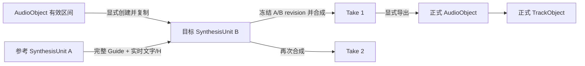

# V5-P 合成单元集成规范

> 状态：2026-08-10 产品与架构冻结稿。
>
> 本文定义 `SynthesisUnit` 如何进入 AI-Midi 的对象系统、资源栏、编辑器、A/B 输入、Take 与正式音轨。
>
> Token 轨内部交互以 [`v5p-token-editor-design.md`](./v5p-token-editor-design.md) 为准。
>
> 模型 tensor、runner 与旧 PH 兼容边界以 [`v5p-integration-architecture.md`](./v5p-integration-architecture.md) 为准。
>
> 若旧文档中的 `VocalPart`、独立 `VoiceReference`、Guide 外部引用或 TextObject 主链与本文冲突，以本文为准。

## 1. 目标

AI-Midi 需要把 V5-P 从“四个输入槽调用一次模型”的工具，升级为可反复编辑、生成、比较和返工的工程流程。
用户工作的中心不是一次 render job，而是一个长期存在的合成单元：

```text
AudioObject 的有效音频区间
  -> 创建 SynthesisUnit
  -> 用户显式生成/编辑 Segment、Kana、H Token、MIDI-P
  -> 绑定另一个 SynthesisUnit 作为 A 区参考
  -> 生成一个或多个不可变 Take
  -> 试听和比较
  -> 将选定 Take 导出为正式 AudioObject / TrackObject
```

本文解决以下问题：

- 合成单元从哪里创建；
- Guide 音频由谁拥有；
- 合成单元如何出现在资源栏和编辑器中；
- 旧 TextObject/Whisper 链路如何兼容；
- A 区音色与文字如何绑定；
- 多个合成结果如何保存和导出；
- 什么操作允许产生隐藏副作用。

## 2. 已冻结产品决策

| 项目 | 决策 |
|---|---|
| 创建入口 | 右键用户可见的 `AudioObject`，选择“创建合成单元” |
| Guide 范围 | 复制该 AudioObject 当前解析后的有效音频区间，不复制整个原始文件 |
| Guide 所有权 | 复制到项目存储，成为 SynthesisUnit 自有且不可被源对象变化影响的音频资产 |
| 创建副作用 | 创建时只有 Guide；Whisper、SOFA、GAME、Kana/H 生成均不自动运行 |
| 编辑入口 | 双击 `SynthesisUnitObject` 打开专用合成单元编辑器 |
| B 区控制 | Segment、Kana、H Token、MIDI-P 都是合成单元内部独立物化轨道 |
| A 区来源 | 绑定另一个 `SynthesisUnitObject`，不分别绑定音色 AudioObject/TextObject |
| A 音频 | 始终使用参考单元的完整 Guide，不允许使用 Take，不选择局部范围 |
| A 文字 | 实时跟随参考单元当前文字/H revision |
| A 的 MIDI-P | 不消费；adapter 按训练/推理合同清零 A 区 MIDI 条件 |
| Take | 每次合成新增不可变 Take；旧 Take 不覆盖、不随当前轨道变化 |
| 正式音轨 | Take 只有经过“导出到正式音轨”才物化为普通 AudioObject/TrackObject |
| 默认位置 | SynthesisUnit 继承来源 AudioObject 的 `timelineStart`，导出 Take 时默认回到该位置 |
| TextObject | 现有 TextObject 和旧 Whisper 链路暂时保留；新合成单元内部链路不依赖 TextObject |

## 3. 对象定位

### 3.1 四种对象不得混合

| 对象 | 角色 | 可持续编辑 | 直接进入正式时间线 |
|---|---|---:|---:|
| `AudioObject` | 普通音频资源或编排素材 | 仅普通音频操作 | 是 |
| `SynthesisUnitObject` | 一段歌声的 Guide、控制轨、A 绑定与 Take 容器 | 是 | 否 |
| `SynthesisTake` | 某次 A/B/control/model snapshot 的不可变合成候选 | 否 | 否 |
| 导出的 `AudioObject/TrackObject` | 已采用的正式编排结果 | 按普通音频处理 | 是 |

`SynthesisUnitObject` 是资源与工程对象，不是一次作业，也不是普通时间线 clip。它可以在没有任何 Take
时存在，也可以在多次编辑后保存多个 Take。

### 3.2 对象关系



创建 SynthesisUnit 不删除、不替换、不静音来源 AudioObject。删除或修改来源 AudioObject 也不能改变已创建
SynthesisUnit 的 Guide。

## 4. SynthesisUnit 数据合同

以下 schema 是产品合同草案，字段名可随现有对象树风格调整，但所有权与行为不能改变：

```ts
interface SynthesisUnitObjectNode extends BaseTreeNode {
  kind: 'synthesisUnit'
  synthesisUnit: {
    schema: 'aisvc.synthesis-unit.v1'

    guide: OwnedGuideAudio
    frameContract: SynthesisFrameContract

    segmentTrack: SegmentTrack
    kanaTrack: KanaTrack
    hTokenTrack: HTokenTrack
    midiPTokenTrack: MidiPTokenTrack

    reference: SynthesisReferenceBinding | null

    unitRevision: number
    takes: SynthesisTake[]
    activeTakeId: string | null

    defaultTimelineStart: number | null
    createdAt: string
    updatedAt: string
  }
}

interface OwnedGuideAudio {
  assetId: string
  audioSHA256: string
  sampleRate: number
  channels: number
  sampleCount: number
  duration: number

  source: {
    sourceAudioObjectId: NodeId
    sourceAssetId: string
    sourceAssetSHA256?: string
    effectiveStartSample: number
    effectiveEndSampleExclusive: number
    sourceTimelineStart: number | null
    resolverManifest?: string
  }
}

interface SynthesisFrameContract {
  sampleRate: 44100
  hopSamples: 2048
  frameRate: number
  frameCount: number
  compilerVersion: string
}

interface SynthesisReferenceBinding {
  unitId: NodeId
  audioSource: 'guide'
  range: 'full-guide'
  revisionPolicy: 'follow-latest'
  boundAt: string
}
```

### 4.1 内部轨道初始状态

新建合成单元时：

```text
Guide:    ready
Segment:  empty / revision 0
Kana:     empty / revision 0
H Token:  empty / revision 0
MIDI-P:   empty / revision 0
Reference: unbound
Takes:    empty
```

创建动作不能为了“看起来完成”而隐式运行 Whisper、SOFA、GAME 或 tokenizer。所有非 Guide 信息必须来自
用户在编辑器内执行的显式命令。

### 4.2 Frame contract

Guide 的音频区间固定后，SynthesisUnit 获得固定的本地 sample/frame 坐标。所有内部轨道使用同一个
`frameCount`，本地 frame 0 对应 Owned Guide 的 sample 0。

创建后的普通文字、H 和 MIDI-P 编辑不得改变 Guide 边界或 frameCount。当前 B-local 实现及 official
VAE 实测均已闭合为：

```text
frameCount = floor(sampleCount / 2048)
modelSampleCount = frameCount * 2048
trailingSampleCount = sampleCount - modelSampleCount
```

不能通过浮点 duration 猜 frame。2026-08-11 已用本机 official VAE
`dc2c4a8ec9731594951a27eff4a188a89b82859649c341c51d050101d1ce0b39` 对整除、带 trailing
和真实 1,548,645-sample Guide 验证，实际 encode shape 与上述 floor 公式一致。runner 仍须把实际
encode shape 回写 audit，并与预编译结果逐次比对。

### 4.3 A/B frame map 与唯一静音间隔

V5-P 联合推理的波形顺序冻结为：

```text
A 完整 Owned Guide
-> 约 0.5s 的可变零样本 gap，使 B sample 0 吸附到 frame start
-> B 完整 Owned Guide
-> 44,100 个零样本（1.0s decode rear，只在 B 末尾）
```

AB 之间没有其他自动插入的空白。B Guide 自身从 local frame 0 到第一枚歌词/H token 之间的静音属于
B 内容，不是 AB gap。名义 gap 是 22,050 samples；正式 gap 取离该名义位置最近的 2048-sample
边界，恰好一半时向后取整：

```text
AOwnedFrames  = floor(A.samples / 2048)
bStartFrame   = floor((A.samples + 22,050 + 1,024) / 2048)
gapSamples    = bStartFrame * 2048 - A.samples
refFrames     = actual VAE frames(A.samples + gapSamples) == bStartFrame
BOwnedFrames  = floor(B.samples / 2048)
melodyFrames  = actual VAE frames(B.samples + 44,100)
B joint frame = refFrames + B local frame
totalFrames   = refFrames + melodyFrames
```

因此实际 gap 位于 21,027--23,074 samples（约 0.4768--0.5232s），调整量相对 0.5s 位于
`-1,023..+1,024` samples。它是为了坐标闭合而量化的可变间隔，不是任意风格参数。预编译时按
official VAE 已验证的 floor 公式计算，运行时仍以实际 VAE shape 为权威；两者不同立即失败。

真实 1,548,645-sample Guide 有 357 trailing samples，正式 gap 为 22,171 samples
（0.502743764s），B start sample 为 1,570,816、joint frame 为 767；official VAE 实测 shape 为
`[1,64,767]`。固定 22,050-sample legacy evaluator 会得到 766 帧，但其 B sample 0 没有精确落在
frame start，不能继续作为正式编辑坐标合同。B 的 1.0s rear 仍可能增加 21 或 22 帧。

历史 evaluator 在 latent 侧固定裁 `floor(44100/2048)=21` 个 rear frame；当 B trailing samples
触发进位时，latent 结果会多出一帧。正式 Take 在保留该推理上下文后，还要把解码 WAV 精确裁到
`BOwnedFrames * 2048` samples，保证输出长度回到编辑器的 B-local frame contract。

当前实现入口为 `client/src/object-workbench/synthesisABFrameMap.ts`；它保存 padding samples、实际/预期
frame、B offset、latent crop 和最终 sample trim，并允许 runner 回填实际 VAE frame 数做一致性门禁。

### 4.4 Joint H 与上下文终端 SEP

用户已裁决：为了复现训练 renderer，A/B 两个独立 H layer 合并时，两个最外侧 SEP 由 adapter 放到
联合上下文中的训练位置；其余普通 H、PUL 和句内 SEP 逐 frame 原样消费。

```text
A 最后 SEP joint frame = bStartFrame + B 第一枚发音 token local frame - 1
B 最后 SEP joint frame = totalFrames - 1
```

例如 B 第一枚发音 token 在 local frame 8，则 A 最后 SEP 位于 B-local frame 7 对应的 joint frame。
这是使用 B Guide 自身前导空白，不是增加第二段 AB gap。若 B 第一枚 token 在 local frame 0，A SEP
位于 `bStartFrame-1`，即 frame-aligned gap 的最后一帧。

若某一侧最后 SEP 前一帧是 `PUL=366`，说明终端句处于 PUL fallback。训练 renderer 会把 PUL 连续
重复到新 SEP 前一帧，因此 adapter 必须同步延伸 PUL 尾部；普通 phone 终端只移动 SEP，中间保持 0。
输入 terminal SEP 必须是该本地 H layer 的最后一个非零 event，B 第一枚发音 token 前也不得有无法归属的
SEP/PUL，否则 preflight 失败，不能猜。

Text Control 生成 H 时现在保存逐句 `placementMode` provenance。已知终端为 `sentence/unknown` 表示
whole-sample Exact 或不可审计 fallback；它不能在保留用户 direct H 的同时套用 phone/PUL 重定位，因而
正式 preflight 硬拒绝。没有自动 provenance 的完整手工 layer 记作 `user`，按用户已确认的 direct
terminal 结构执行上述规则。

该合同已在 `synthesisDirectH.ts`、`synthesis-direct-control.service.ts` 和
`v5p_direct_control.py` 三端实现。服务端重新计算并逐 token 比对前端 `hTransport`；普通发音 token
序列、SEP 数量或任一非结构 frame 发生变化都会拒绝。

## 5. 从 AudioObject 创建合成单元

### 5.1 用户入口

AudioObject 右键菜单新增：

```text
创建合成单元
```

命令成功后：

1. 在可编辑项目对象区域的“Synthesis Units/合成单元”目录创建新对象；
2. 复制 AudioObject 的有效音频区间到项目自有 asset/blob；
3. 保存来源对象、有效 sample range、hash 和默认时间线位置；
4. 初始化空的四条控制轨、空引用和空 Take 列表；
5. 打开或选中新建对象，但不启动任何分析任务。

### 5.2 “有效区间”的含义

有效区间必须复用当前项目的 audio render input resolver 语义，而不是简单复制源文件路径。至少要尊重：

- 当前 AudioObject/legacy segment 的 source start/end sample；
- 当前对象解析后的有效时长；
- 与该对象对应的时间线起点；
- 当前 resolver 已经明确支持的组合/裁剪规则。

如果 AudioObject 表示源文件中的 10.0s 到 13.0s，新 Guide 就是这 3.0s，不是整个源文件。若未来 AudioObject
支持时间伸缩或离线效果，应由 resolver manifest 明确记录复制的是何种 resolved 结果，不能静默改变定义。

### 5.3 复制语义

产品语义是“Owned Guide copy”。底层项目 blob 可以按 hash 去重以避免相同字节重复占用空间，但不能把
SynthesisUnit 的可用性重新绑定到源 AudioObject 生命周期。

撤销创建命令时，可以删除新对象和仅由它拥有的 Guide asset；如果 asset 已被其他对象按 hash 复用，则只
减少引用，不删除仍被使用的数据。

### 5.4 默认时间线位置

若来源 AudioObject 有明确 `timelineStart`，写入 `defaultTimelineStart`。若来源只是没有编排位置的资源对象，
该值为 `null`。

`defaultTimelineStart` 只服务 Take 导出，不参与 SynthesisUnit 内部 frame 计算。用户移动来源 AudioObject 不会
更新已经创建的 SynthesisUnit。

## 6. 合成单元编辑器入口

双击资源栏中的 `SynthesisUnitObject`，打开对象绑定的合成单元编辑器 tab。编辑器复用当前工作台的 tab
生命周期，不在 SVS 工具面板中塞入完整 Token 编辑界面。

编辑器负责：

- Guide 播放与 waveform；
- Segment/Kana/H/MIDI-P 的显式生成和编辑；
- A 区参考绑定；
- preflight；
- 发起合成；
- Take 试听、比较、命名、删除和导出。

右侧工具区可以显示当前对象状态、模型 preset 和生成命令，但四条控制轨的具体操作只存在于合成单元编辑器。

## 7. 所有分析与对齐均为显式操作

### 7.1 创建后允许的显式命令

```text
Guide Audio -> Whisper + SOFA -> SegmentTrack
Guide Audio -> GAME -> MidiPTokenTrack
Segment     -> SOFA/tokenizer -> KanaTrack
Segment     -> 当前 PH 等价 renderer -> HTokenTrack
Kana        -> SOFA/tokenizer -> HTokenTrack
```

每条命令只覆盖一个目标轨和命令声明的 frame 范围。详细覆盖合同见 Token 编辑器设计文档。

### 7.2 不允许的隐藏行为

- 创建 SynthesisUnit 后自动转录；
- 绑定 A 区后自动生成 A 的 Segment/Kana/H；
- 点击“合成”时发现缺轨后自动运行 Whisper、SOFA 或 GAME；
- 修改 Segment 后自动重建 Kana/H；
- 修改 Kana 后自动重建 H；
- 为了通过 preflight 而静默覆盖用户轨道。

缺失信息必须显示为可定位的 preflight 问题，由用户决定运行哪个生成命令。

## 8. 新旧 Whisper 链路

### 8.1 旧通用链路保留

```text
AudioObject -> 现有 Whisper/SOFA 工具 -> TextObject
```

现有 TextObject、TextObject Editor、`useRenderWhisperPipeline` 和相关项目结构暂不删除。它们继续服务旧项目、
通用转录和旧 SVS 工作流，也可以作为新链路实现参考。

### 8.2 新链路只存在于 SynthesisUnit 内部

```text
SynthesisUnit.OwnedGuide
  -> internal Whisper/SOFA command
  -> structured transcript/alignment result
  -> replace SegmentTrack only
```

新链路不能先创建 TextObject 再读回 SynthesisUnit。底层模型和 runner 可以复用，但输出对象合同必须分离：

```ts
TranscriptRunner -> TranscriptResult
SofaRunner       -> AlignmentResult

LegacyWhisperAdapter        -> TextObject
SynthesisUnitWhisperAdapter -> SegmentTrack revision
```

是否在未来废弃 TextObject 是独立迁移议题，不属于 V5-P 首版完成条件。

## 9. A 区参考合成单元

### 9.1 为什么绑定 SynthesisUnit

分别选择音色 AudioObject 和音色 TextObject 会重新制造两者时长、内容、revision 和对齐关系失配的问题。
另一个 SynthesisUnit 已经拥有固定 Guide 和可审计文字/H，因此是完整的 A 区材料提供者。

### 9.2 绑定交互

合成单元编辑器顶部或检查器提供紧凑的“A 区参考”槽：

- 从左侧资源栏拖入另一个 SynthesisUnit；
- 点击槽可以定位或打开参考单元；
- 提供试听其完整 Guide 的播放命令；
- 提供解除、更换绑定命令；
- 显示参考单元名称、Guide 时长、当前 unit/H revision 和状态。

槽只接受 SynthesisUnit，不接受 AudioObject、TextObject 或 Take。只有音色 AudioObject 时，用户先显式创建一个
参考 SynthesisUnit，再为其生成和校对文字/H。

### 9.3 A 区消费合同

新 Take 发起时，从参考单元读取：

```text
完整 Owned Guide
当前 SegmentTrack revision
当前 KanaTrack revision
当前 HTokenTrack revision
编译后的 dense A H
```

模型直接消费的文字事实是编译后的 H；Segment/Kana 用于解释、审计和再次生成。A 的 MIDI-P 不进入条件，
adapter 继续按训练流程清零 A 区 MIDI。

参考单元缺少合法 H/Text 控制时，目标单元 preflight 失败。系统只提示用户打开参考单元并显式生成/修正，
不能自动补齐。

### 9.4 完整 Guide 与实时跟随

绑定不保存局部 range，也不允许选择 Take：

```text
audioSource = guide
range = full-guide
revisionPolicy = follow-latest
```

若参考单元在绑定后修改 Segment/Kana/H，目标单元下一次合成使用其最新 revision。目标单元应显示“参考已更新”
或新的 revision，但不能修改已有 Take。

### 9.5 Snapshot 与可复现性

“实时跟随”只决定下一次合成解析哪个 revision。作业开始时必须冻结 A snapshot；Take 完成后永久记录实际使用的：

- reference unit ID；
- Guide asset ID/hash/sample count；
- reference unit revision；
- Segment/Kana/H revision；
- dense H hash；
- adapter/runtime/tokenizer/placement hash。

因此 A 更新后，新 Take 可以使用最新 A，旧 Take 仍保持原始声音和审计数据。

当前 `synthesisMaterialSnapshot.ts` 已实现对象层 snapshot compiler。它在启动作业前：

- 校验 B 当前绑定的确是所传 A，拒绝自身、未绑定和 stale binding；
- 校验 A/B Guide frame contract 与 HTrack，校验 B dense MIDI-P 且禁止有效区出现 PAD=256；
- 深拷贝 A/B Guide、unit/Segment/Kana/H/MIDI-P revision、本地 dense H、H event provenance 和 B class；
- 生成同一份 frame-aligned `ABFrameMap`，可接收 runner 的实际 padded VAE frame 做一致性检查；
- 构造 joint MIDI-P class transport：B class 只平移 `+bStartFrame`，rear 写 REST=255；
- 明确记录 `[0,bStartFrame)` 必须在 P embedding 后清零，不能把占位 REST 当成 A MIDI 条件。

snapshot 返回后继续编辑原 A/B 对象不会改变其中的数组。正式 client 会把 A/B Owned Guide 分别上传到
独立 data 作业目录；Node preflight 重新校验 WAV hash/sample/frame、canonical snapshot SHA 和全部派生
transport。随后 `job.json` 以 `wx` 写入不可变作业目录，并把自身文件 SHA 交给 Python runner 二次校验。

实际 P tensor 门禁也已通过：`v5p_direct_control.py` 从正式 40K EMA checkpoint 读取 `[257,128]`
embedding，真实 B-local 756-class 轨在 joint `[767,1523)` 逐 frame tensor-identical；A prefix 在查表后
由 98,176 个非零值清为 0，21-frame rear 全部为 REST embedding。正式 runner 已复用同一
`v5p_direct_control.py` 合同，不再只把门禁结果留作离线报告。

`synthesis-direct-control.service.ts` 已增加服务端可信 preflight：它不信任前端派生值，而是重新计算
ABFrameMap/MIDI transport，核对 dense H 与 event provenance、Guide sample/frame、revision 和 canonical
snapshot SHA，并锁定 40K EMA/official VAE/config/placement/P 模块 hash。`/api/synthesis/v5p/preflight`
和 `/api/synthesis/v5p/run` 已接入 Guide 上传、不可变 job manifest、JSON Lines 进度和 Take WAV 下载；
joint H 外侧 SEP 已按用户裁决闭合。

正式 `v5p_direct_runner.py` 只复用 evaluator 的 EMA 模型构造、`policy.sample` 和 official VAE，不加载
GAME，也不调用训练 renderer。它只消费 snapshot 中经三端重算一致的 joint H 和 MIDI-P class：P embedding
后清零 A，B tensor-identical，rear 使用 REST。真实 64-frame fixture 已完成 CUDA 1-step 与 32-step smoke：

```text
A/B local samples: 131,072 / 131,072
bStartFrame: 75
joint total: 160
A terminal SEP / B first lyric / B terminal SEP: 82 / 83 / 159
reference latent / generated latent: [1,75,64] / [1,160,64]
32-step output: 131,072 samples, 2.972154s, peak 0.614258, RMS 0.146866
checkpoint SHA256: 3a532f5bd5965dff7d011996b7ca72d7884c5494a2d44d6c28b0bab21bace96c
official VAE SHA256: dc2c4a8ec9731594951a27eff4a188a89b82859649c341c51d050101d1ce0b39
```

### 9.6 非递归与循环保护

当一个单元作为 A 材料提供者时，只导出自己的 Owned Guide 与文字/H，不读取它自己绑定的 A，也不读取其 Takes。
必须拒绝自身绑定，并拒绝形成明显的循环引用，以免 UI 状态和删除依赖变得不可解释。

## 10. Take 生命周期

### 10.1 每次合成都新增 Take

```ts
interface SynthesisTake {
  id: string
  name: string
  status: 'queued' | 'running' | 'ready' | 'failed' | 'cancelled'

  outputAssetId?: string
  outputSHA256?: string
  duration?: number

  targetSnapshot: {
    unitId: NodeId
    guideSHA256: string
    unitRevision: number
    segmentRevision: string
    kanaRevision: string
    hRevision: string
    midiPRevision: string
    denseHHash: string
    midiPHash: string
  }

  referenceSnapshot: {
    unitId: NodeId
    guideSHA256: string
    unitRevision: number
    segmentRevision: string
    kanaRevision: string
    hRevision: string
    denseHHash: string
  }

  render: {
    presetId: string
    checkpointSHA256: string
    vaeSHA256: string
    adapterSHA256: string
    seed: number
    parameters: Record<string, unknown>
  }

  createdAt: string
  completedAt?: string
  error?: string
}
```

正在运行 revision 3 时，用户可以继续把当前控制编辑到 revision 4。作业输出仍归属 revision 3，不能冒充
当前结果，也不能写回或覆盖当前控制轨。

### 10.2 内部试听

Take 默认保存在 SynthesisUnit 内，不自动创建正式音轨。编辑器应允许：

- 播放 Guide；
- 播放任意 ready Take；
- 在多个 Take 间快速切换；
- loop 当前选区试听；
- 重命名、删除或标记当前偏好 Take；
- 查看 Take 使用的 A/B revisions 与模型参数。

Take 不是 A 区参考来源。`activeTakeId` 只表示编辑器当前偏好/默认试听结果，不改变 reference binding。

首版 Vue 已实现生成、运行进度、ready/failed 生命周期、Take 列表、active Take 选择和试听。Take 完成时
输出 WAV 被复制进项目 blob 并绑定 generated AudioAsset；启动后用户继续编辑当前单元不会改变它记录的
A/B revisions 和 snapshot hash，ready Take 二次写入会被拒绝。loop、重命名和删除仍可作为后续编辑体验增强，
不阻塞 direct-control 全链路。

## 11. 导出到正式音轨

用户对某个 ready Take 执行：

```text
导出到正式音轨
```

系统执行：

1. 将 Take 输出物化为普通项目 AudioAsset/AudioObject；
2. 创建或选择正式 audio TrackFolder；
3. 创建对应 TrackObject；
4. 若 SynthesisUnit 有 `defaultTimelineStart`，使用该位置；
5. 若没有默认位置，要求用户在时间线放置或使用当前播放头；
6. 在导出对象 provenance 中记录来源 unit/take ID 与 output hash。

导出的 AudioObject/TrackObject 与 SynthesisUnit 解耦：

- 修改控制轨不更新已导出音频；
- 删除或重跑 Take 不删除已导出音轨；
- 移动正式 TrackObject 不改变 SynthesisUnit 默认位置；
- 同一个 Take 可以被导出到多个时间线位置。

需要新结果时生成新 Take 并再次显式导出，不能用后台任务静默替换正式音轨。

## 12. Revision、状态与脏标记

### 12.1 当前状态

建议的 SynthesisUnit 状态由可计算事实产生，不单独维护一个容易失真的枚举：

```text
Guide ready?
Segment/Kana/H/MIDI-P revisions present?
Reference bound and valid?
Current control hashes match any existing Take snapshot?
Background job state?
```

### 12.2 变化传播

| 变化 | 当前控制 | 旧 Take | 下次生成 |
|---|---|---|---|
| 修改 B Segment/Kana | 只改目标轨 revision | 保留 | 只有显式重建 H 后 H 才变化 |
| 修改 B H | H revision 变化 | 保留并显示来自旧 revision | 使用新 H |
| 修改 B MIDI-P | MIDI-P revision 变化 | 保留并显示来自旧 revision | 使用新 MIDI-P |
| 参考 A 修改文字/H | B 控制不变 | 保留 | 实时解析 A 最新 revision |
| 参考 A 更换 Guide | 已绑定 B 显示参考更新 | 保留 | 使用新 Guide/hash，重新 preflight |
| 更换 A 绑定 | B 控制不变 | 保留 | 使用新参考 snapshot |

轨道 revision 和 Take snapshot 是事实来源；“过期”只表示现有 Take 不对应当前 A/B snapshot，不表示 Take 无效。

## 13. Preflight

点击生成只执行校验和 snapshot，不执行隐藏生成。至少检查：

- B Owned Guide 可读且 hash/sampleCount 与 frame contract 一致；
- B H 和 MIDI-P 已由用户显式生成并通过 token/class/frame 校验；
- B H/MIDI-P layer hash 与编辑器确认 revision 一致；
- 已绑定另一个 SynthesisUnit 作为 A；
- A 使用完整 Owned Guide，且 Guide 可读；
- A 当前 H/Text revision 存在并可编译；
- A/B frame mapping、padding、A MIDI 清零和 B-local crop 与 preset 一致；
- 没有自身/循环引用；
- job snapshot 记录完整 A/B revisions、hash、preset、checkpoint、VAE、adapter 和 seed；
- 当前不存在会覆盖相同目标 revision 的非法写事务。

Segment/Kana 与 H 的内容差异可以是警告，因为 direct-control runner 以 H 为最终事实；缺少 A/B H 或 B MIDI-P
则是硬错误。

## 14. 与当前 AI-Midi 对象系统的关系

当前对象树已有 `audio`、`midi`、`text`、`trackObject`、`trackFolder`、`group`，以及
`workspace/resource/trackSources/tracks/groups/renders` 区域。首版接入需要新增：

```text
TreeNodeKind += 'synthesisUnit'
Media editor tab += 'synthesisUnit'
可编辑对象区中的 Synthesis Units folder
Take 内部资产与导出命令
```

SynthesisUnit 不应伪装成 AudioObject，否则资源栏无法区分“可编排音频”和“带控制轨的工程对象”；也不应放入
`renders`，因为它不是一次只读工具产物。

Guide 的底层音频仍使用现有 `AudioAsset`/project blob 能力。Take 输出在内部可以使用 generated asset，但只有
导出后才创建普通 AudioObject 和 TrackObject。

## 15. 命令边界

建议使用语义命令而不是组件直接改树：

```text
CreateSynthesisUnitFromAudioObject
DeleteSynthesisUnit
BindSynthesisReferenceUnit
UnbindSynthesisReferenceUnit
ReplaceSynthesisTrackRange
StartSynthesisTakeJob
CancelSynthesisTakeJob
RenameSynthesisTake
DeleteSynthesisTake
ExportSynthesisTakeToTimeline
```

每个命令必须定义 undo、asset 引用计数、revision 和失败回滚。长任务只能提交结果到启动时声明的目标
revision；创建/绑定/导出等对象命令不能藏在 runner 进程回调里临时拼装。

## 16. 迁移顺序

### 当前实现检查点（2026-08-11）

Phase 1 已完成。Phase 2 已完成 Guide -> Segment、Segment -> Kana/H、Kana -> H、Guide -> MIDI-P、
单轨事务和 Kana/H/MIDI-P 人工编辑。Phase 3 的 reference binding、material snapshot 和可信 preflight
已完成；Phase 4 的 direct runner、不可变 Take、试听和显式导出已完成首版。具体真实门禁和代码入口见
[`v5p-integration-handoff.md`](./v5p-integration-handoff.md)。

B-local `frameCount=floor(samples/2048)` 与 frame-aligned `ABFrameMap` 已完成：约 0.5s 的可变 gap
让 B sample 0 精确对应 B-local VAE frame 0；它不作为用户可编辑对象。对象层 material snapshot、
joint H、joint MIDI class transport、实际 P embedding/A 清零、Guide 作业资产冻结、正式 runner、Take
与导出均已完成并经过 32-step 真实短样本门禁。

### Phase 1：对象与 Guide 所有权

1. 增加 `SynthesisUnitObjectNode` schema、持久化与对象树 policy；
2. 增加 AudioObject 右键“创建合成单元”；
3. 复用 resolver 复制有效区间到 Owned Guide；
4. 保存默认时间线位置和来源 provenance；
5. 双击打开空轨道的 SynthesisUnit editor shell。

完成门禁：删除或修改源 AudioObject 后，新单元仍能独立播放完全相同的 Guide；创建过程未运行分析模型。

### Phase 2：内部显式生成

1. 抽出中立 Whisper/SOFA runner result；
2. 保留旧 `AudioObject -> TextObject` adapter；
3. 增加 `Guide -> SegmentTrack` adapter；
4. 接入 GAME `Guide -> MIDI-P`；
5. 接入 Segment/Kana/H 的训练等价 compiler 和单轨 replace transaction。

完成门禁：每个操作只改变一个目标轨 revision，创建单元、打开编辑器和点击合成都不会隐式分析。

`Kana -> H` 已按单 Kana control range 闭合：普通对象覆盖到下一 Kana 起点，句末对象覆盖到自身 Kana
SEG；完整分句经 SOFA/tokenizer/训练 placement 生成候选，只接受 phone placement、逐 mora 内容完全
一致和唯一句末 SEP。真实 756-frame Guide 的第一句 `speechEnd=115/controlEnd=128`，最后一个 Kana
生成 `n@104`、`a@108`、`SEP@127`，强制覆盖手工 H 和一次 undo 均只改变 HTrack。

### Phase 3：A 区合成单元绑定

1. 增加资源栏拖放和对象选择器；
2. 只允许完整 Guide、禁止 Take/range；
3. 实现 follow-latest revision 显示；
4. 实现 A material snapshot、循环校验和 A MIDI 清零；
5. 缺少 A H 时提供可定位 preflight，不自动修复。

当前 Vue 编辑器已实现 Phase 3 的交互壳和对象命令：A 槽可以从资源树拖入
`application/x-aisvc-node-id`，也可以从合成单元选择器选择；绑定只写入
`audioSource=guide`、`range=full-guide`、`revisionPolicy=follow-latest`，并提升目标
`unitRevision`。槽位显示参考 Guide 完整时长、参考 unit/H revision 和当前 Segment/H 准备状态，
提供参考 Guide 试听、打开参考单元、解除绑定和 undo/redo。对象层拒绝自身绑定、传递循环、非合成单元
以及删除仍被引用的参考单元。

第 4 项的 material snapshot/A MIDI 清零与第 5 项正式 preflight 已完成。编辑器仅在 A/B H、B MIDI-P、
完整 Guide 和 reference binding 同时满足时允许生成；缺项不会自动修复或隐式运行分析模型。

完成门禁：修改 A H 后，新 Take 使用新 revision，旧 Take 的 reference snapshot 和音频保持不变。

### Phase 4：Take 与导出

1. runner 直接消费冻结的 A/B control snapshot；
2. 每次作业创建独立 Take；
3. 实现 Guide/Take 试听和 Take 列表；
4. 实现显式导出为 AudioObject/TrackObject；
5. 使用来源 `timelineStart` 作为默认导出位置。

完成门禁：多个 Take 可独立试听；控制变化不改变旧 Take；已导出正式音轨不被后续作业替换。

### Phase 5：旧链兼容与迁移评估

1. 保持旧 Whisper/TextObject 与旧 SVS route 可用；
2. 为新旧链增加共享 runner 的回归测试；
3. 统计 TextObject 在新工作流中的实际使用；
4. 合成单元成熟后再决定 TextObject 弃用计划，不提前删除。

## 17. 必须通过的用户场景

### 场景 A：从裁剪音频创建

用户把一个长音频裁成三秒，右键创建合成单元。新 Guide 只有这三秒。创建完成后四条控制轨为空，GPU
没有启动。删除原 AudioObject 后 Guide 仍可播放。

### 场景 B：显式生成控制

用户先运行 Whisper/SOFA，只出现 Segment；再运行 Segment -> Kana/H，只改变对应目标轨；再运行 GAME，
只写 MIDI-P。任何步骤失败都保留其他轨道。

### 场景 C：绑定 A 区

用户从资源栏拖入另一个 SynthesisUnit。目标单元试听该参考的完整 Guide。参考缺少 H 时生成按钮不可用并定位
原因；用户打开参考单元显式生成 H 后，目标单元通过 preflight。

### 场景 D：A 实时更新

B 已绑定 A。用户修改 A 的 H 后再次生成 B，新 Take 记录 A 的新 revision；旧 Take 继续使用和显示旧 A
snapshot，不重新计算也不改变声音。

### 场景 E：多个候选

用户用不同 seed/参数生成多个 Take，在编辑器内快速试听和比较。所有 Take 保留，当前控制继续可编辑。

### 场景 F：导出到正式音轨

用户选择一个 Take 导出。系统创建普通 AudioObject/TrackObject，并默认放到来源 AudioObject 的
`timelineStart`。后续修改 SynthesisUnit 或删除 Take，正式音轨保持不变。

### 场景 G：旧 Whisper 不回归

用户继续通过现有 Whisper 工具把普通 AudioObject 转成 TextObject，旧项目和旧编辑器行为不变。该流程不创建
SynthesisUnit，也不影响合成单元内部 Whisper adapter。

## 18. 完成定义

只有同时满足以下条件，SynthesisUnit 才算真正融入 AI-Midi：

- AudioObject 右键可从有效区间创建独立 Owned Guide 的 SynthesisUnit；
- 创建不触发任何隐藏分析；
- 双击对象进入正式合成单元编辑器；
- 四条轨道都由用户显式生成或编辑，并按单目标事务保存 revision；
- A 区只绑定另一个 SynthesisUnit 的完整 Guide 和实时文字/H；
- A 不使用 Take，A MIDI 按训练合同清零；
- 每个 Take 冻结完整 A/B snapshot，多个 Take 非破坏性共存；
- Take 只有显式导出才进入普通 AudioObject/TrackObject 与正式时间线；
- 导出默认位置继承来源 AudioObject 的 `timelineStart`；
- 旧 Whisper/TextObject 和旧 SVS 兼容链仍可使用；
- runner 实际消费编辑器确认的 H/MIDI-P，而不是合成时重新从 Guide 推导。
